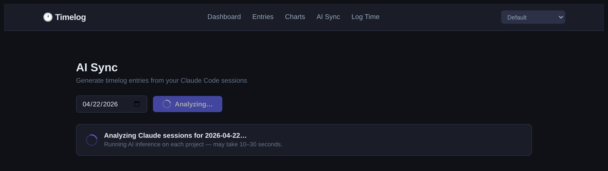
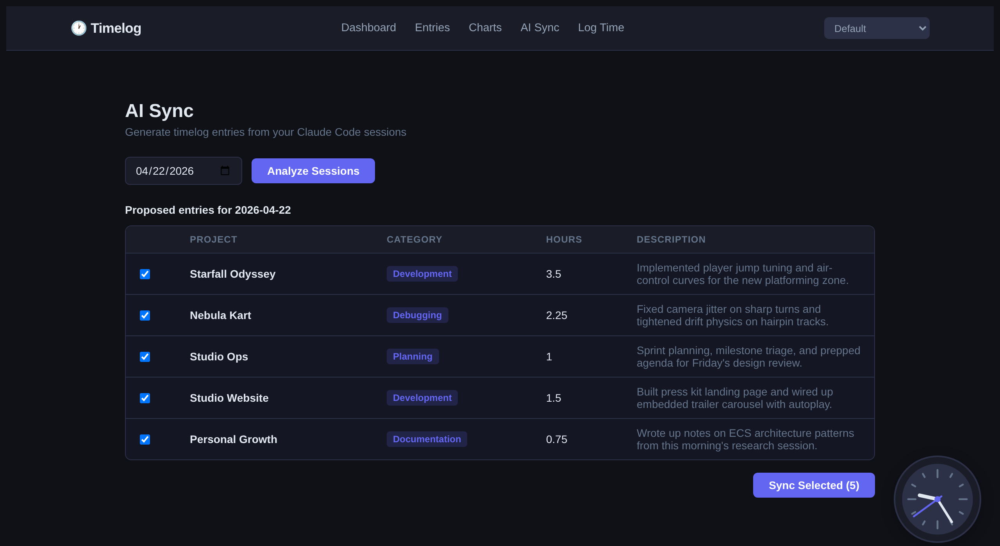
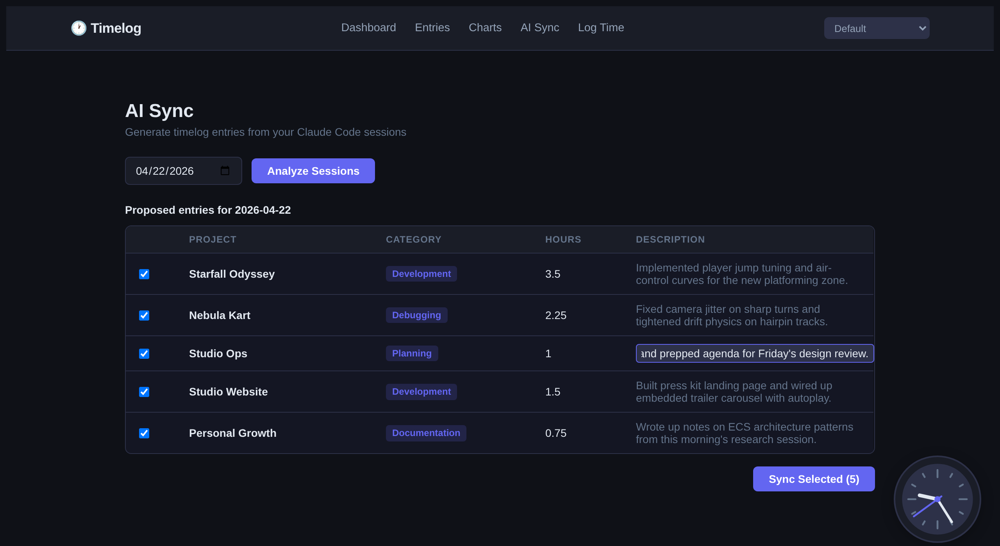

# 🕐 Timelog

<details>
<summary>Table of Contents</summary>

<!-- mtoc-start -->

* [How it works](#how-it-works)
* [Installation and pre-requisites](#installation-and-pre-requisites)
* [Dashboard](#dashboard)
* [Log Time](#log-time)
* [Live Timer](#live-timer)
* [Themes](#themes)
* [Charts](#charts)
* [Entries](#entries)
  * [Activity heatmap](#activity-heatmap)
  * [Sorting](#sorting)
  * [Click-to-filter](#click-to-filter)
  * [Date filter](#date-filter)
  * [Edit and delete entries](#edit-and-delete-entries)
  * [CLI equivalents](#cli-equivalents)
* [`tlclaude` — Claude Code Integration](#tlclaude--claude-code-integration)
  * [`tlclaude sessions`](#tlclaude-sessions)
  * [`tlclaude preview`](#tlclaude-preview)
  * [`tlclaude sync`](#tlclaude-sync)
  * [AI Sync page](#ai-sync-page)
* [Data & Backups](#data--backups)

<!-- mtoc-end -->

</details>

Tired of living with an intern timelog project that accidentally became production software?  
Started a new company with an even worse time tracking application than you could have ever imagined?  
Tired of having to use your freaking mouse?!

Well - look no further. Timelog is your one-way ticket to time efficiency!

## How it works

This application runs entirely locally in Docker. Two containers — a Python/FastAPI backend and a SvelteKit frontend — are managed by Docker Compose. Your data lives in a SQLite file at `./data/timelog.db`, bind-mounted from your host so it's always accessible and easy to back up.

The web UI at `localhost:3000` is the primary interface. A set of optional CLI commands (`tlshow`, `tlsum`, `tlupdate`, etc.) are available as shell functions that forward into the API container — no separate install required.

## Installation and pre-requisites

Pre-requisites:
* Docker + Docker Compose
* Git

**1. Clone the repo:**
```bash
git clone https://github.com/awall451/timelog-vibed.git
cd timelog-vibed
```

**2. Source the dev helpers:**
```bash
source dev.sh
```

Add this to your `~/.bashrc` to make `tlstart`, `tlstop`, and all `tl*` commands available in every shell.

**3. Start the app:**
```bash
tlstart
```

That's it! Docker builds and starts both containers on first run.

| Service  | URL                      |
|----------|--------------------------|
| Frontend | http://localhost:3000    |
| API      | http://localhost:8888    |

```bash
tlstop   # stop everything
```

Your database is created automatically at `./data/timelog.db` on first run.

## Dashboard

The dashboard shows today's hours against an 8-hour goal, a live table of today's entries, and a bar chart of all-time hours by project.


**In the terminal**, you can pull the same data with:

```bash
tlsum today
Total hours: 6.25

tlsum yesterday
Total hours: 7.50
```

```bash
tlshow today
+----+-----------------+-------------+-------------------------------+-------+------------+
| id | project         | category    | description                   | hours | date       |
+----+-----------------+-------------+-------------------------------+-------+------------+
|  1 | Nebula Kart     | Development | Multiplayer lobby rework      |  2.50 | 2026-04-28 |
|  2 | Studio Ops      | Meetings    | Sprint planning               |  1.00 | 2026-04-28 |
|  3 | Studio Ops      | Development | Deploy pipeline fixes         |  2.75 | 2026-04-28 |
+----+-----------------+-------------+-------------------------------+-------+------------+

tlshow yesterday   # same format, previous day
tlshow last        # most recent single entry — handy to verify a submission
```

## Log Time

The **Log Time** page is the primary way to add entries. Fill in project, category, description, hours, and an optional date (defaults to today), then hit **Save Entry**. Project and category fields support autocomplete from your existing data.


**In the terminal**, `tlupdate` is the CLI equivalent — it walks you through interactive prompts for the same fields:

```bash
tlupdate            # entry for today
tlupdate 2026-02-03 # entry for a specific date (YYYY-MM-DD)
```

## Live Timer

A floating clock widget lives in the bottom-right corner of every page. Click it to expand a panel where you can start a timer for a project and category.

**Starting a timer:**
1. Click the clock to open the panel
2. Fill in Project, Category, and an optional Description
3. Click **Start Timer** — once running, the panel shows elapsed time and a **Stop & Log** button

<table align="center">
<tr>
<td align="center"><br><sub>Open</sub></td>
<td align="center" valign="middle"><strong>&nbsp;→&nbsp;</strong></td>
<td align="center"><br><sub>Fill in details</sub></td>
<td align="center" valign="middle"><strong>&nbsp;→&nbsp;</strong></td>
<td align="center"><br><sub>Running</sub></td>
</tr>
</table>

Clicking **Stop & Log** calculates hours, pre-fills the Log Time form, and redirects you there to review and save. Timer state persists to `localStorage`, so refreshing or navigating away won't lose a running timer.

## Themes

Six themes are available from the selector in the top navigation bar. Your choice is saved to `localStorage` and persists across page reloads.

| Theme | Description |
|---|---|
| Default | Dark blue-grey |
| Tokyo Night | Deep navy with purple accents |
| Cyberpunk | High contrast neon |
| Dracula | Classic purple dark theme |
| Rosé Pine | Muted warm tones |
| Catppuccin Latte | Light theme |

<table>
<tr>
<td align="center"><strong>Default</strong><br></td>
<td align="center"><strong>Tokyo Night</strong><br></td>
<td align="center"><strong>Cyberpunk</strong><br></td>
</tr>
<tr>
<td align="center"><strong>Dracula</strong><br></td>
<td align="center"><strong>Rosé Pine</strong><br></td>
<td align="center"><strong>Catppuccin Latte</strong><br></td>
</tr>
</table>

## Charts

The **Charts** page (`/charts`) gives you a visual breakdown of where your time goes. All charts respond to the **From / To** date range picker in the top-right.


**Hours by Project** and **Hours by Category** donuts show the share of total hours for each, with exact hour counts and percentages in the legend.


**Daily Hours** shows a stacked bar chart of the last 14 days, with each project as a color segment. Gaps in the bars are days with no logged time.


The page also includes a **Weekly Pace** sparkline (last 28 days vs. an 8h/day goal line) and a **Project × Category** heat matrix showing exactly where hours go across both dimensions.

## Entries

The **Entries** page shows your full history. A GitHub-style activity heatmap sits above the table, followed by a sortable, filterable entry list. The footer shows the entry count and total hours for the current view.


### Activity heatmap

The heatmap displays the last 52 weeks of activity as a grid of cells — darker cells mean more hours logged that day. Color intensity has five levels: no activity, <2h, <4h, <6h, and 6h+.


**Click any cell** to filter the entries table to that day — a date chip appears in the filter bar. Click the × on the chip to clear.


**Filter-aware:** When a project or category filter is active, the heatmap re-derives its intensities from only the matching entries. This lets you see your activity pattern for a specific project at a glance.


### Sorting

Click the **Date** column header to toggle between newest-first and oldest-first. An ↑/↓ indicator shows the active direction.


### Click-to-filter

Click directly on any value in the table to filter to it — no need to touch the dropdowns:

- **Project name** → filters the table and syncs the project dropdown
- **Category badge** → filters the table and syncs the category dropdown
- Click the same cell again (or the × chip) to clear

Project filter active:


Category filter active:


### Date filter

Click the **Date** button in the filter bar to reveal a text input. Type any partial ISO date to filter:

| Input | Result |
|---|---|
| `2026` | All entries in 2026 |
| `2026-04` | All entries in April 2026 |
| `2026-04-15` | Entries on a specific day |

Click the calendar icon inside the input to use a date picker instead of typing. Click **Date** again to collapse — your typed value is retained.


### Edit and delete entries

Hover over any row to reveal the **⋮** action button on the right. Click it to open a dropdown with **Edit** and **Delete** options.


Clicking **Edit** opens a modal pre-filled with the entry's current values. Update any field and hit **Save** — the table updates immediately and re-sorts by date.


Clicking **Delete** shows an inline confirmation (**Yes / No**) before removing the entry.

### CLI equivalents

All the filtering and summarizing available in the Entries UI is also available in the terminal.

**Browse entries:**

```bash
tlshow                              # all entries
tlshow today                        # today only
tlshow yesterday                    # yesterday
tlshow last                         # single most recent entry
tlshow project "Nebula Kart"        # filter by project (quote multi-word names)
tlshow category "Code Review"       # filter by category
tlshow month 2026-04                # filter by month (YYYY-MM)
tlshow projects                     # list all distinct project names
tlshow categories                   # list all distinct category names
```

**Sum hours:**

```bash
tlsum today                         # total for today
tlsum yesterday                     # total for yesterday
tlsum project "Nebula Kart"         # total for a specific project
tlsum category Development          # total for a specific category
tlsum month 2026-04                 # total for a month
tlsum projects                      # hours per project, all time
tlsum projects 2026-04              # hours per project filtered to a month
tlsum categories                    # hours per category, all time
tlsum categories 2026-04            # hours per category filtered to a month
```

Example output:

```
$ tlsum projects 2026-04
+-------------------+-------+
| project           | hours |
+-------------------+-------+
| Nebula Kart       | 28.75 |
| Studio Ops        | 14.50 |
| Starfall Odyssey  |  9.25 |
| Personal Growth   |  5.00 |
+-------------------+-------+

$ tlshow month 2026-04
+-----+-------------------+-------------+----------------------------------+-------+------------+
|  id | project           | category    | description                      | hours | date       |
+-----+-------------------+-------------+----------------------------------+-------+------------+
| 204 | Nebula Kart       | Development | Lobby matchmaking backend        |  3.00 | 2026-04-28 |
| 203 | Studio Ops        | CI/CD       | Docker build cache optimization  |  2.50 | 2026-04-27 |
| 202 | Starfall Odyssey  | Design      | Title screen asset revisions     |  1.75 | 2026-04-26 |
| ... | ...               | ...         | ...                              |   ... | ...        |
+-----+-------------------+-------------+----------------------------------+-------+------------+
```

Run `tlhelp` at any time for a full CLI reference printed to your terminal.

## `tlclaude` — Claude Code Integration

> **Requires:** `pip install -e .` (one-time host install) and `source dev.sh` already in your shell.
>
> **Local-only feature.** `tlclaude` and the AI Sync page both rely on `~/.claude` and the `claude` binary being mounted into the API container from your host. They work great for single-user local deployments but won't function on a hosted/multi-user setup — the server has no access to a remote user's Claude Code session data. Multi-node strategy is tracked in `CLAUDE.md` under *Future Vision*.

If you use [Claude Code](https://claude.ai/code), you already have a detailed record of every session you've worked — which project, when, for how long, and what you were doing. `tlclaude` reads that data and turns it into timelog entries automatically.

At the end of the day, run one command:

```bash
tlclaude sync
```

It finds all your Claude sessions for today, calculates active time (idle gaps over 30 minutes are excluded), sends your conversation excerpts to Claude to infer a category and description, then asks for confirmation before inserting anything. Sessions for the same project are merged into a single entry. Hours are rounded up to the nearest 0.25.

### `tlclaude sessions`

Inspect raw session data for a date without touching the database. Useful for auditing before syncing.

```bash
tlclaude sessions                   # today
tlclaude sessions --date 2026-04-22 # specific date
```

```
Date: 2026-04-22  (18 sessions)

+---------------------------------+---------+----------+-------------------------------------------+-----------+
| Project                         | Start   | Active   | Branch                                    | Session   |
|---------------------------------+---------+----------+-------------------------------------------+-----------|
| claude-token-tracking-dashboard | 07:24   | 3.33h    | feat/plan-detection-and-caveman-fix, main | b135b31d  |
| timelog-vibed                   | 07:45   | 1.37h    | feature/readme-update-v2, main            | 51d70d08  |
| claude-code-dojo                | 09:01   | 2.40h    | —                                         | c009ae39  |
| timelog-vibed                   | 15:00   | 0.87h    | feature/entries-heatmap                   | 89fbac5a  |
| ...                             | ...     | ...      | ...                                       | ...       |
+---------------------------------+---------+----------+-------------------------------------------+-----------+
```

### `tlclaude preview`

See what entries *would* be generated — no inserts, no confirmation. Claude analyzes your session excerpts to produce the category and description. Pass `--no-ai` to skip the Claude call and use keyword heuristics instead.

```bash
tlclaude preview                    # today, AI inference
tlclaude preview --date 2026-04-22  # specific date
tlclaude preview --no-ai            # fast, no API call
```

```
Proposed entries for 2026-04-24:

+------------------+-------------+---------+----------------------------------------------------------+
| Project          | Category    |   Hours | Description                                              |
|------------------+-------------+---------+----------------------------------------------------------|
| easy-local-proxy | Debugging   |    0.5  | Debugged CORS issue breaking timelog-vibed frontend...   |
| harbor           | Development |    1.5  | Built reverse proxy UI with collapsible sidebar nav...   |
| timelog-vibed    | Development |    0.75 | Implemented tlclaude CLI to auto-generate timelog...     |
+------------------+-------------+---------+----------------------------------------------------------+
```

### `tlclaude sync`

The main event. Previews proposed entries, asks for confirmation, then inserts. Safe to run multiple times — if an entry already exists for that project + date, it's skipped.

```bash
tlclaude sync                       # today, confirm before insert
tlclaude sync --yes                 # skip confirmation
tlclaude sync --date 2026-04-22     # backfill a past date
tlclaude sync --date 2026-04-22 --yes --no-ai  # fast backfill
```

> **Note:** On first use, the `./data/` directory may be root-owned (created by Docker). If you see a read-only database error, fix it once with:
> ```bash
> sudo chown $USER:$USER ./data/ ./data/timelog.db
> ```

### AI Sync page

If the terminal isn't your thing, the same flow lives in the browser at `/sync` as **AI Sync**. Pick a date, click **Analyze Sessions**, and the API runs the exact same `build_proposed_entries_with_ai` pipeline the CLI uses — your conversation excerpts go to Claude, which infers a category and a one-sentence description per project.

A spinner and status banner show up while Claude is thinking, so you know inference is in progress (it usually takes 10–30 seconds depending on how many projects you touched that day):



Once the analysis completes, a table of proposed entries appears. Each row is one project, with the AI-generated description, inferred category, and active hours rounded up to the nearest 0.25:



Every cell except the project is **click-to-edit** — category becomes a dropdown, hours becomes a number spinner, description becomes a text input. Tweak whatever Claude got wrong before syncing:



Uncheck any rows you don't want, then hit **Sync Selected** to write them to the database. Rows that already exist for that project + date are dimmed and skipped automatically.

## Data & Backups

Your data lives at `./data/timelog.db` — a plain SQLite file bind-mounted from the host into the container. Back it up like any other file, or open it with any SQLite client for raw access.

**Export to CSV:**

```bash
tlexport
Exporting entries to timelog-2026-04-28.csv...
Export complete: timelog-2026-04-28.csv
```

**Import from CSV** — replaces the entire database with entries from a CSV file. Useful for migrating data or restoring from a backup.

```bash
tlimport timelog-2026-04-28.csv
Importing from timelog-2026-04-28.csv...
Imported 241 entries.
```

The CSV must have the following columns (matching the `tlexport` format):

```
id,project,category,description,hours,date
```

> **Warning:** `tlimport` replaces all existing entries. Export first if you want to keep your current data.

You can also import directly via the API:

```bash
curl -X POST http://localhost:8888/import -F "file=@timelog-2026-04-28.csv"
# {"imported": 241}
```
